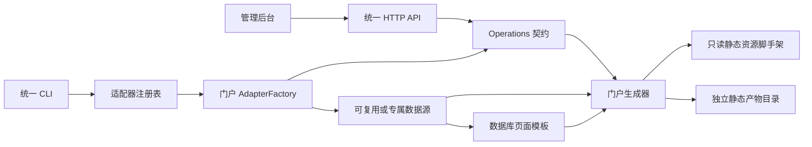
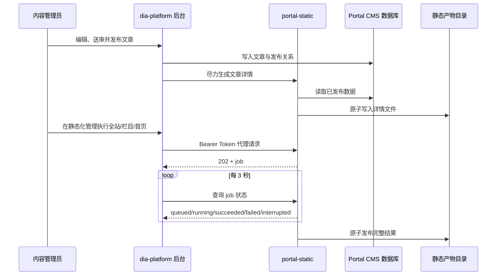

# 总体设计

## 1. 目标与边界

`portal-static` 把不同门户的静态化能力收敛为统一平台。平台统一以下内容：

- `preview`、`generate`、`serve` 三个命令；
- Bearer Token 鉴权和固定 HTTP 端点；
- 同步单项操作、异步批任务、进度、取消和超时；
- 输出路径安全检查、原子发布和媒体地址重写；
- 一站一配置、一站一进程的部署方式；
- 与 `dia-platform/business/portal` 的调用契约。

平台不强求以下内容一致：

- HTML 模板、CSS、JavaScript 和静态资源；
- 页面、栏目和文章的业务模型；
- 数据库、外部接口或文件等数据来源；
- 门户内部页面别名和具体渲染规则。

平台不是运行时多租户系统。一份配置只代表一个站点；站点之间通过独立端口、进程、环境变量和输出目录隔离。

## 2. 三层结构

### 2.1 公共运行内核

`internal/platform` 与 `internal/core` 负责：

- 按 `driver` 查找并构建适配器；
- 加载和校验公共配置；
- 暴露固定 HTTP 路由；
- 鉴权、任务排队、任务取消、超时和进度；
- 请求输出目录和灰度选项的传递；
- 公共错误响应和媒体地址规范化。

命令层不知道 MIIC、CAAM 或任何未来门户的业务细节。未知 `driver` 会在启动阶段报错，并返回当前已注册 driver 列表。

### 2.2 可复用数据源

`internal/sources/portalcms` 对应 Portal CMS MySQL 公共模型，负责连接池、时区、安全 schema、schema 限定查询环境，以及页面与模板的有效绑定读取。

数据源不是平台强制依赖。预览模式使用适配器内置 demo；生产模式由适配器工厂选择 MySQL、其他数据库、HTTP API 或文件数据源。

### 2.3 门户适配器

`internal/adapters/<driver>` 保存站点专属内容：

- 配置映射和校验；
- demo 数据；
- 数据查询投影和 view model；
- 模板渲染和页面生成规则；
- 中英文页面别名；
- 业务错误到 HTTP 状态码的分类。

所有适配器都必须返回完整 `httpapi.Operations`。缺少整站、页面、栏目、文章、删除、关联刷新、页面名校验、错误分类或输出路径校验时，运行时会拒绝启动。

## 3. 运行模式

### 3.1 Preview

`preview` 使用适配器自包含的 demo 与测试模板，不连接生产数据库。它与 production 使用同一个生成器和页面结构，生成主页面、栏目列表、文章详情及资源，从而尽早发现渲染或路径问题。

### 3.2 Generate

`generate` 连接生产数据源并同步生成整站，适合首次发布、部署验收和离线任务。使用 Portal CMS 时，模板通过 `page.template_id` 绑定并从 `template.source_code` 读取；每次操作重新取得模板快照。生成结果写入 `paths.dist_root`。

### 3.3 Serve

`serve` 启动 HTTP 服务，供管理后台或自动化系统调用。批处理异步返回 job，单页、单栏目和单文章操作同步返回结果。

## 4. 管理后台协作链路

管理后台保存的是“静态化程序访问令牌名”，不是令牌值。后台进程读取该名称对应的环境变量，并将值放入 `Authorization: Bearer ...`；静态化服务读取其 YAML 中 `server.token_env` 指定的同名环境变量。两边必须得到同一个值。

## 5. 数据可见性

对于 Portal CMS 数据源，文章是否进入产物以发布关系和适配器规则为准，而不是只看文章表是否存在。以 CAAM 为例，`article_column_publish` 是栏目发布关系的权威来源；草稿、未审核、已下线和没有有效发布关系的记录不得进入产物。

内容管理员发布文章后，后台会尽力生成详情页。首页、栏目列表和其他聚合页可能仍需要刷新，因此正式发布流程应按[管理后台使用指南](admin-workflow.md)执行。

## 6. 文件发布与并发模型

- 批处理同一时刻只允许一个活动任务；重复提交返回 `409 Conflict`。
- 批任务有无进度超时和最长运行时间，支持主动取消。
- 完整站点在同级临时目录生成、校验后再替换目标目录，避免对外暴露半成品。
- 单项生成使用文件锁和临时文件/目录发布，减少并发写入冲突。
- 请求可以指定绝对输出目录，但不能使用文件系统根目录、相对目录或与只读源目录重叠的目录。
- job 保留 24 小时，内存中最多保留 100 个；进程重启后历史 job 不恢复。

## 7. 媒体地址策略

媒体解析在公共层统一执行：

- `same_origin` 输出站内绝对路径，避免把环境域名写死进 HTML；
- `aliases` 把历史上传目录统一到当前目录；
- `rewrite_origins` 去除数据库遗留旧域名，再按当前模式输出；
- 外部合法 URL 保持外部链接语义。

## 8. 设计取舍

- 选择“适配器统一接口”而不是“统一业务模型”：避免为了复用而破坏不同门户现有规则。
- 选择“一站一进程”而不是运行时多租户：配置、故障、资源和发布范围更容易隔离。
- 选择后台代理静态化请求：令牌不暴露给浏览器，权限和操作日志继续由后台统一管理。
- 选择数据库管理生产模板：后台模板保存后在下一次生成生效，避免数据库与服务器模板文件形成两个真相源。
- 选择原工程只读：原门户继续提供静态资源和模板迁移参考，但构建和运行不会污染原仓库。
- 选择完整能力校验：适配器不能在运行后才返回“此门户不支持”，从入口保证操作流程一致。
